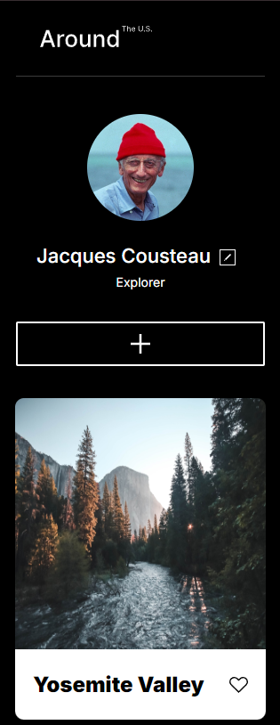

# Project 3: Around The U.S.

## Overview

- [Description](#description)
- [Features](#features)
- [Images](#preview-images)
- [Links](#links)
- [Author](#author)

---

### Description

Making use of the CSS grid layout function we have a sleek minimalist style profile design.

### Features

- Responsive website created from scratch using Figma
- Scales properly and smoothly from a minimum of 320px up to 1280px
- Makes full use of @font-face, @import, and @media queries

### Preview Images

### Links

- [Github Repo](https://github.com/Jaden-EC/se_project_aroundtheus)
- [Live Site](https://jaden-ec.github.io/se_project_aroundtheus/)
- [Video Presentation](https://drive.google.com/file/d/1mIf9k-4qGY3wQ58A9gpe-9UuSXGZubeZ/view?usp=sharing)

---

### Author

- Github - [Jaden-EC](https://github.com/Jaden-EC)
